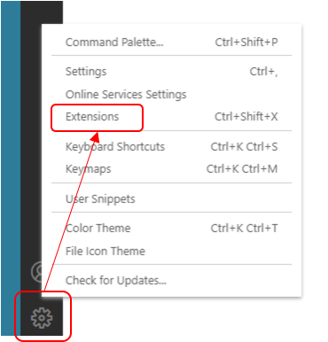
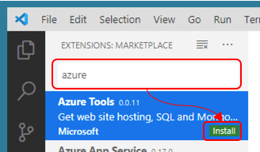

# 開発環境の設定

## JDK

https://docs.microsoft.com/ja-jp/azure/azure-functions/functions-reference-java?tabs=consumption

Windows 10 用JDKのインストール

https://www.azul.com/downloads/zulu-community/?architecture=x86-64-bit&package=jdk


## Maven

https://maven.apache.org/install.html

Function の開発言語にJavaを利用する場合は、mavenでビルド＆デプロイを実施します。

. mavenのウェブサイトからダウンロードします
. アーカイブを展開してPATHを通します
. mvn コマンドが実行可能なことを確認します
+
```
mvn --version
```

Windowsの場合の出力例
```
PS C:\Users\myadmin> mvn --version
Apache Maven 3.6.3 (cecedd343002696d0abb50b32b541b8a6ba2883f)
Maven home: C:\Users\myadmin\bin\apache-maven-3.6.3\bin\..
Java version: 1.8.0_251, vendor: Oracle Corporation, runtime: C:\Program Files (x86)\Java\jre1.8.0_251
Default locale: ja_JP, platform encoding: Cp1252
OS name: "windows 10", version: "10.0", arch: "x86", family: "windows"
```

## Function Core Tools

### node.js のインストール

Function Core Toolsをインストールするために node.js をインストールします。

https://nodejs.org/ja/


### Function Core Tools のインストール

https://docs.microsoft.com/ja-jp/azure/azure-functions/functions-run-local?tabs=windows%2Ccsharp%2Cbash

npm を利用して、Function Core toolsをインストールします。

```
npm install -g azure-functions-core-tools@3
```

インストール時のログ出力例
```
PS C:\Users\myadmin\ws> npm install -g azure-functions-core-tools@3
C:\Users\myadmin\AppData\Roaming\npm\azfun -> C:\Users\myadmin\AppData\Roaming\npm\node_modules\azure-functions-core-tools\lib\main.js
C:\Users\myadmin\AppData\Roaming\npm\azurefunctions -> C:\Users\myadmin\AppData\Roaming\npm\node_modules\azure-functions-core-tools\lib\main.jsC:\Users\myadmin\AppData\Roaming\npm\func -> C:\Users\myadmin\AppData\Roaming\npm\node_modules\azure-functions-core-tools\lib\main.js

> azure-functions-core-tools@3.0.2630 postinstall C:\Users\myadmin\AppData\Roaming\npm\node_modules\azure-functions-core-tools
> node lib/install.js

attempting to GET "https://functionscdn.azureedge.net/public/3.0.2630/Azure.Functions.Cli.win-x64.3.0.2630.zip"
[==================] Downloading Azure Functions Core Tools

Telemetry
---------
The Azure Functions Core tools collect usage data in order to help us improve your experience.
The data is anonymous and doesn't include any user specific or personal information. The data is collected by Microsoft.

You can opt-out of telemetry by setting the FUNCTIONS_CORE_TOOLS_TELEMETRY_OPTOUT environment variable to '1' or 'true' using your favorite shell.

+ azure-functions-core-tools@3.0.2630
added 51 packages from 31 contributors in 87.17s
```


PowerShellでfuncコマンドが実行できない場合

https://docs.microsoft.com/ja-jp/powershell/module/microsoft.powershell.core/about/about_execution_policies?view=powershell-7


```
PS C:\Users\myadmin\ws> Set-ExecutionPolicy -ExecutionPolicy ByPass -Scope CurrentUser
PS C:\Users\myadmin\ws> Get-ExecutionPolicy -List
```
```
        Scope ExecutionPolicy
        ----- ---------------
MachinePolicy       Undefined
   UserPolicy       Undefined
      Process       Undefined
  CurrentUser          Bypass
 LocalMachine       Undefined
```

 


## Visual Studio Code

### Visual Studio Code のインストール

https://code.visualstudio.com/

Visual Studio Codeをダウンロードしてインストールします。


### Azure Plugin のインストール

. Visual Studio Codeの左下の歯車アイコンをクリックし、メニューアイテムの Extensions をクリックします。
+


. 検索フィールドに `azure` と入力して拡張機能の一覧を表示して、Azure Tools をインストールします。
+



