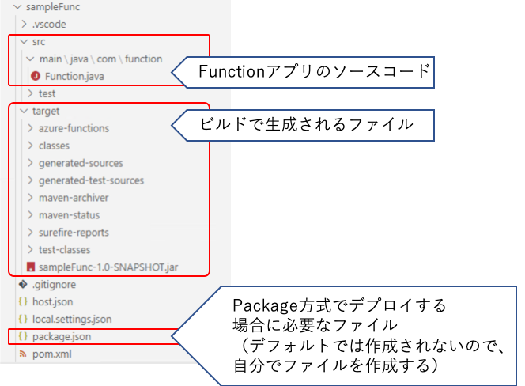

# 基本のFunction

https://docs.microsoft.com/ja-jp/azure/azure-functions/functions-develop-local

Function の開発から実行までの流れを理解するために、サンプルとして提供されているHttpトリガーのFunctionをビルド、デプロイします。


## Visual Studio Codeでの開発

### サンプルアプリケーションの作成

. 開発用にディレクトリを作成します
+
例）sampleFunc

. VisualStudioのコマンドパレットを開きます
+ 
Ctrl+Shift+p または 上部のメニューで View -> Command Palette...

. `> Azure Functions: Create New Project` を選択します

. フォルダ選択のダイアログでプロジェクト用のフォルダ選択します

. 言語の選択で Java を選択します

. group id はデフォルトのまま変更せずリターンを入力します

. artifact id はデフォルトのまま変更せずリターンを入力します

. version はデフォルトのまま変更せずリターンを入力します

. package name はデフォルトのまま変更せずリターンを入力します

. app nameは Function の URL のなるのい一意になる文字列に変更しリターンを入力します
+
例）HttpExampleKeiOmizo

. Open in current window を選択しリターンを入力します
link::images/funcws_vscode_newproject.mp4[]

これで、Maven のプロジェクトが生成されました。



. pom.xml と同じ階層に package.json ファイルを作成します


### ローカルでの実行

. VSCodeのウィンドウにフォーカスをして `F5` キーを押下して、ビルドとローカルでのFunctionの実行をします
+
ビルドとローカルでのFunctionの起動ができると、以下のようなメッセージが出力されます。
+
```
Now listening on: http://0.0.0.0:7071
        Application started. Press Ctrl+C to shut down.
HttpExample: [GET,POST] http://localhost:7071/api/HttpExample
```

. ブラウザでローカル実行されているFunctionのURLにアクセスします

### Azureへのデプロイ

Azureにデプロイするためのプロパティは pom.xml に記載されています。
リソースグループ、App Service Plan名、Region, ランタイムのOSを自分か環境にあわせて編集します。

pom.xml の抜粋
```
            <plugin>
                <groupId>com.microsoft.azure</groupId>
                <artifactId>azure-functions-maven-plugin</artifactId>
                <version>${azure.functions.maven.plugin.version}</version>
                <configuration>
                    <!-- function app name -->
                    <appName>${functionAppName}</appName>
                    <resourceGroup>java-functions-group</resourceGroup>
                    <appServicePlanName>java-functions-app-service-plan</appServicePlanName>
                    <region>westus</region>
                    <!-- <pricingTier></pricingTier> -->
                    <!-- <disableAppInsights></disableAppInsights> -->
                    <runtime>
                        <!-- runtime os, could be windows, linux or docker-->
                        <os>windows</os>
                    </runtime>ß
```

====
OSにlinuxを選択した場合は、従量課金プランが利用できないので`<pricingTier>` で、App Service Plan または　Premium Plan の SKU を設定します。

https://docs.microsoft.com/ja-jp/azure/azure-functions/functions-premium-plan#available-instance-skus
====

. mvn コマンドを利用してデプロイします
+
初回のデプロイ時は、途中で Azure ポータルへログインするための認証画面に遷移するので、ログインをしてください
+
```
mvn azure-functions:deploy
```


## コマンドラインでの開発

. mvnのArchtypeを指定して、Functionのプロジェクトを作成します
+
Powershell or cmd
+
```
mvn archetype:generate "-DarchetypeGroupId=com.microsoft.azure" "-DarchetypeArtifactId=azure-functions-archetype"
```
+
bash
+
```
mvn archetype:generate -DarchetypeGroupId=com.microsoft.azure -DarchetypeArtifactId=azure-functions-archetype
```

## ローカルでの実行

https://docs.microsoft.com/ja-jp/azure/azure-functions/functions-create-first-azure-function-azure-cli?pivots=programming-language-java&tabs=powershell%2Cbrowser#run-the-function-locally

. pom.xml があるディレクトリに移動します

. package.json ファイルを作成します

. Functionのアプリケーションをビルドします
+
```
mvn clean package
```

. Functionのアプリケーションをローカルで実行します
+
```
mvn azure-functions:run
```

以下のように、ローカル実行されているHttpトリガーのFunctionのURLが出力されるので、ブラウザでアクセスします。
この例では http://localhost:7071/api/HttpExample にブラウザでアクセスします。
```
Now listening on: http://0.0.0.0:7071
        Application started. Press Ctrl+C to shut down.
HttpExample: [GET,POST] http://localhost:7071/api/HttpExample
```

### Azureへデプロイ

. mvn コマンドを利用してデプロイします
+
初回のデプロイ時は、途中で Azure ポータルへログインするための認証画面に遷移するので、ログインをしてください
+
```
mvn azure-functions:deploy
```

## Bindings の設定

https://docs.microsoft.com/ja-jp/azure/azure-functions/functions-add-output-binding-storage-queue-vs-code?pivots=programming-language-java

Inbound/Outbound の Bindings を設定していきます。


### QueueStorageのデプロイ

. Azureポータルで、ストレージアカウントを作成します
. Queue Storageを追加します
+
Queue Name: outqueue


### local.settings.json の編集
function.json から AppStorage という名前で参照している Queue Storage の接も文字列を追加します。

```
{
  "IsEncrypted": false,
  "Values": {
    "AzureWebJobsStorage": "＜Functioのの設定情報が保持されるストレージアカウントの接続文字列＞",
    "FUNCTIONS_WORKER_RUNTIME": "java",
    "AppStorage": "＜Queue Storageの接続文字列＞"
  }
}
```

### Function.java の編集
HttpTriggerで実行されるFunctionからアウトバウンドのバインディングを利用できるように編集します。

. import 文を追加します
+
OutboundBinding と QueueOutputのアノテーションクラスをインポートします
+
```
import com.microsoft.azure.functions.OutputBinding;
import com.microsoft.azure.functions.annotation.QueueOutput;
```

. メソッドの定義を変更します
+
run() パラメータに QueueOutput を追加します。
+
 name: bindingの名称
 queueName: キュー名
 connection: QueueStorageの接続文字列の変数名
+
```
    @FunctionName("HttpExample")
    public HttpResponseMessage run(
            @HttpTrigger(
                name = "req",
                methods = {HttpMethod.GET, HttpMethod.POST},
                authLevel = AuthorizationLevel.ANONYMOUS)
                HttpRequestMessage<Optional<String>> request,
            @QueueOutput(name = "msg", queueName = "outqueue", connection = "AppStorage") OutputBinding<String> msg,
            final ExecutionContext context)
```

. QueueStorageにメッセージを送信するコードを追加します
+
```
        if (name == null) {
            return request.createResponseBuilder(HttpStatus.BAD_REQUEST).body("Please pass a name on the query string or in the request body").build();
        } else {
            msg.setValue(name);
            msg.setValue(query);
            return request.createResponseBuilder(HttpStatus.OK).body("Hello, " + name).build();
        }
```


### ローカルでの実行

ローカルで実行します。
```
mvn clean package azure-functions:run
```

### Azureへのデプロイ
Azureにデプロイします。
```
mvn azure-functions:deploy
```


### 参考：function.json

Java以外の言語では、Bindingsの設定をアノテーションではなく function.json というJSONファイルに定義します。

function.json
```
{
    "bindings": [
        {
            "authLevel": "function",
            "type": "httpTrigger",
            "direction": "in",
            "name": "req",
            "methods": [
                "get",
                "post"
            ]
        },
        {
            "type": "queue",
            "direction": "out",
            "name": "msg",
            "queueName": "outqueue",
            "connection": "AppStorage"
        }
    ]
}
```
